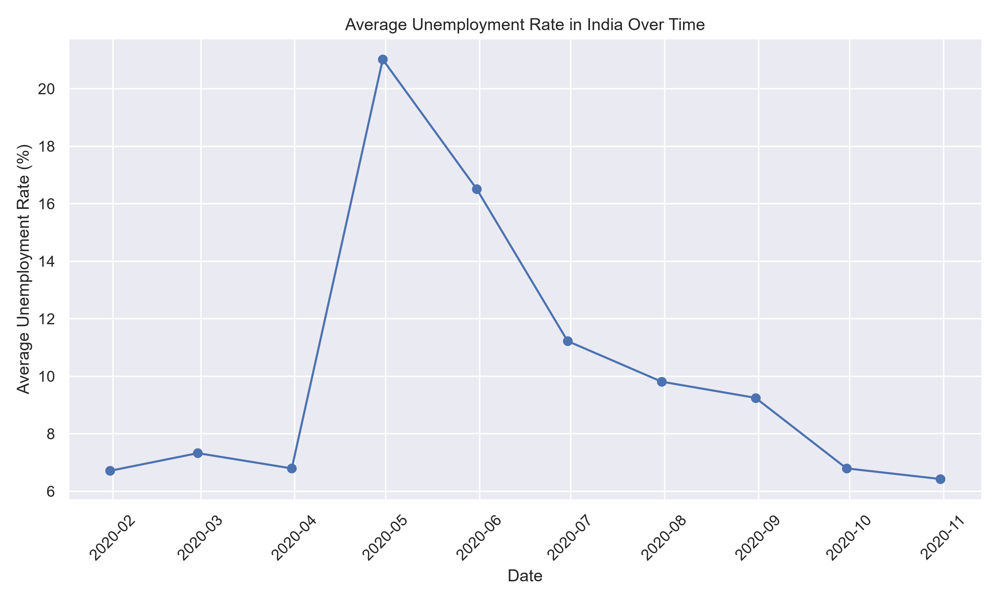
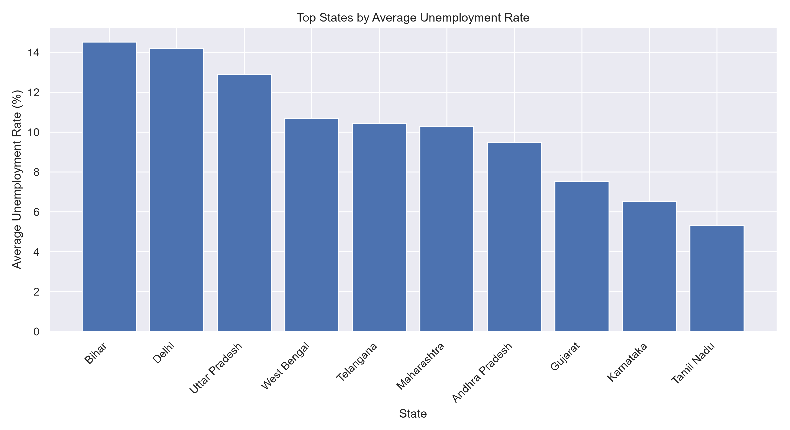
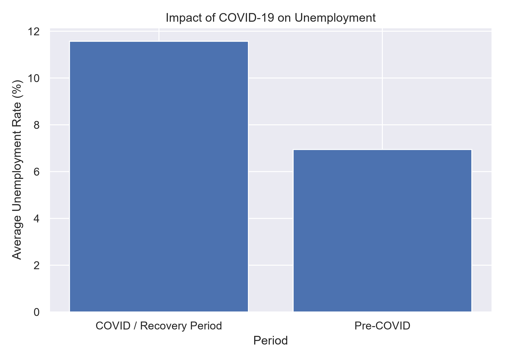
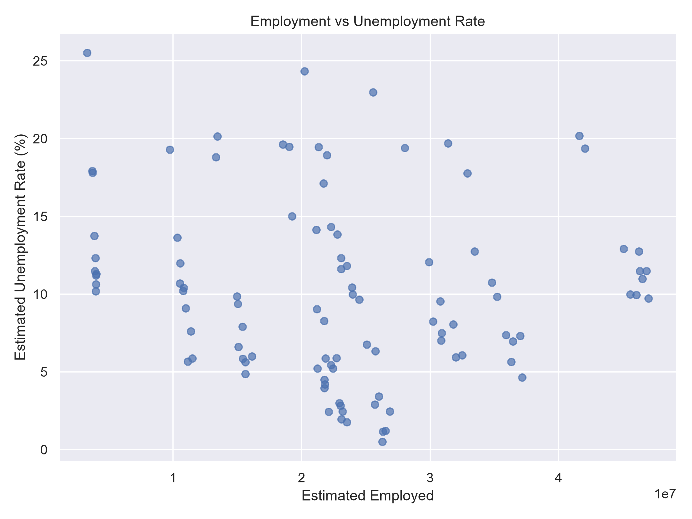
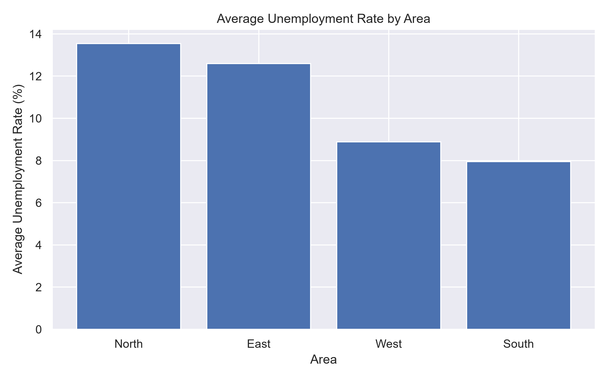

# Unemployment Analysis with Python

## CodeAlpha Data Science Internship – Task 2

This project is developed as part of the CodeAlpha Data Science Internship.

The objective of this project is to analyze unemployment data using Python and identify trends, patterns, regional differences, and the impact of the COVID-19 period on unemployment.

---

# Problem Statement

Unemployment is an important economic indicator that affects individuals, families, and the overall development of a country.

The COVID-19 pandemic significantly affected employment opportunities and economic activities. This project uses Python for data analysis and visualization to understand unemployment trends and identify meaningful insights from the dataset.

---

# Project Objectives

- Load and explore the unemployment dataset
- Check for missing values
- Clean and preprocess the data
- Analyze unemployment trends over time
- Compare unemployment rates across different states
- Analyze the impact of COVID-19 on unemployment
- Compare employment and unemployment
- Perform area-wise unemployment analysis
- Generate meaningful visualizations
- Extract important insights from the data

---

# Technologies Used

- Python
- Pandas
- NumPy
- Matplotlib
- Seaborn

---

# Python Libraries

## Pandas

Used for:

- Loading the dataset
- Data cleaning
- Data manipulation
- Data analysis

## NumPy

Used for:

- Numerical operations
- Data processing

## Matplotlib

Used for:

- Creating charts
- Data visualization
- Graph generation

## Seaborn

Used for:

- Statistical data visualization
- Improved graphical analysis

---

# Project Workflow

```text
Unemployment Dataset
        ↓
Data Loading
        ↓
Data Exploration
        ↓
Check Missing Values
        ↓
Data Cleaning
        ↓
Exploratory Data Analysis
        ↓
Unemployment Trend Analysis
        ↓
State-wise Analysis
        ↓
COVID-19 Impact Analysis
        ↓
Employment vs Unemployment Analysis
        ↓
Area-wise Analysis
        ↓
Data Visualization
        ↓
Key Insights
```

---

# Dataset Analysis

The dataset contains information related to unemployment, including:

- Region
- Date
- Frequency
- Estimated Unemployment Rate (%)
- Estimated Employed
- Estimated Labour Participation Rate (%)
- Area

These features are used to analyze unemployment patterns and employment trends.

---

# Project Outputs

## 1. Overall Unemployment Trend

This graph shows how the average unemployment rate changes over time.



---

## 2. State-wise Unemployment Analysis

This graph compares the average unemployment rate across different states or regions.



---

## 3. COVID-19 Impact Analysis

This analysis compares unemployment before COVID-19 with the COVID and recovery period.



---

## 4. Employment vs Unemployment

This visualization shows the relationship between estimated employment and the unemployment rate.



---

## 5. Area-wise Unemployment Analysis

This graph compares the average unemployment rate across different areas.



---

# Data Cleaning

The following data preprocessing steps are performed:

- Removed missing values
- Removed unnecessary spaces from column names
- Converted the Date column into datetime format
- Converted numerical columns into numeric format
- Prepared the dataset for analysis and visualization

---

# Exploratory Data Analysis

The project performs exploratory data analysis to understand:

- Dataset structure
- Number of rows and columns
- Column names
- Missing values
- Statistical summary
- Unemployment trends
- Regional differences

---

# COVID-19 Impact Analysis

One of the major objectives of this project is to understand the effect of the COVID-19 period on unemployment.

The data is divided into:

```text
Pre-COVID
        ↓
COVID / Recovery Period
```

The average unemployment rates of these periods are compared to identify changes in employment conditions.

---

# Key Insights

The program automatically identifies and displays important insights, including:

- The state with the highest average unemployment rate
- The peak unemployment period
- Average unemployment during the Pre-COVID period
- Average unemployment during the COVID and recovery period
- Employment and unemployment patterns across regions

---

# Project Structure

```text
CodeAlpha_UnemploymentAnalysis/
│
├── unemployment_analysis.py
├── sample_unemployment_data.csv
├── requirements.txt
├── README.md
├── DATASET_NOTE.txt
│
└── images/
    ├── 01_unemployment_trend.png
    ├── 02_statewise_unemployment.png
    ├── 03_covid_impact.png
    ├── 04_employment_vs_unemployment.png
    └── 05_area_analysis.png
```

---

# Installation

## Step 1: Clone the Repository

```bash
git clone https://github.com/peddireddythanusri/CodeAlpha_UnemploymentAnalysis.git
```

## Step 2: Navigate to the Project Folder

```bash
cd CodeAlpha_UnemploymentAnalysis
```

## Step 3: Install Required Libraries

```bash
pip install -r requirements.txt
```

---

# How to Run

Run the Python program using:

```bash
python unemployment_analysis.py
```

If you are using Windows and the above command does not work:

```bash
py unemployment_analysis.py
```

---

# Program Output

When the program runs successfully, it will:

```text
Load Dataset
      ↓
Display Dataset Information
      ↓
Check Missing Values
      ↓
Clean Data
      ↓
Analyze Unemployment Trends
      ↓
Perform State-wise Analysis
      ↓
Analyze COVID-19 Impact
      ↓
Generate Visualizations
      ↓
Display Key Insights
      ↓
Save Graphs in Images Folder
```

The generated graphs are automatically saved inside:

```text
images/
```

---

# Requirements

Install all required libraries using:

```bash
pip install -r requirements.txt
```

The project uses:

```text
pandas
numpy
matplotlib
seaborn
```

---

# Dataset Information

The project includes:

```text
sample_unemployment_data.csv
```

This allows the project to run immediately.

For the final internship project, the official unemployment dataset can be placed in the main project folder with the filename:

```text
Unemployment_Rate_upto_11_2020.csv
```

The Python program is designed to automatically use the official dataset when it is available.

---

# Future Improvements

Possible improvements include:

- Interactive dashboard development
- Streamlit web application
- More advanced statistical analysis
- Machine Learning-based unemployment prediction
- Real-time unemployment data integration
- Advanced regional comparison
- Interactive data visualization
- Deployment as a web application

---

# Author

Peddireddy Thanusri

B.Tech – Computer Science Engineering (Data Science)  
CVR College of Engineering

---

# Internship

CodeAlpha Data Science Internship

Task 2 – Unemployment Analysis with Python
